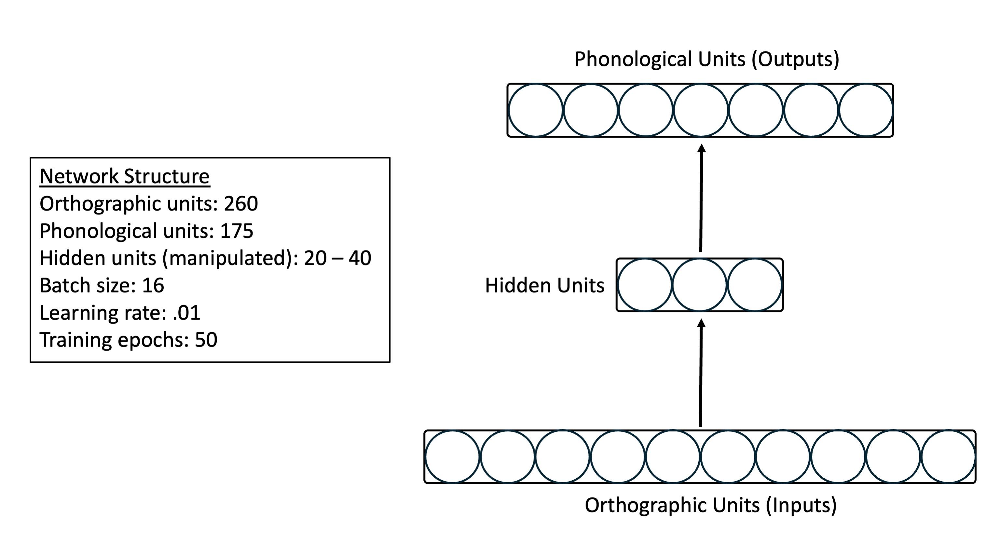
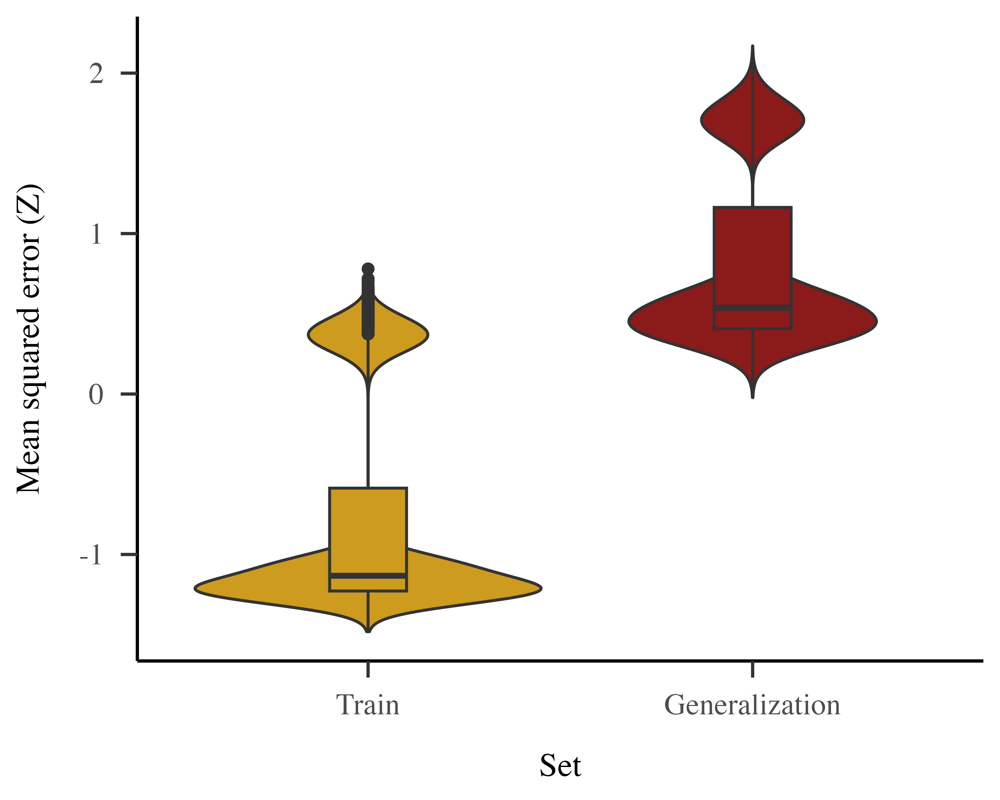
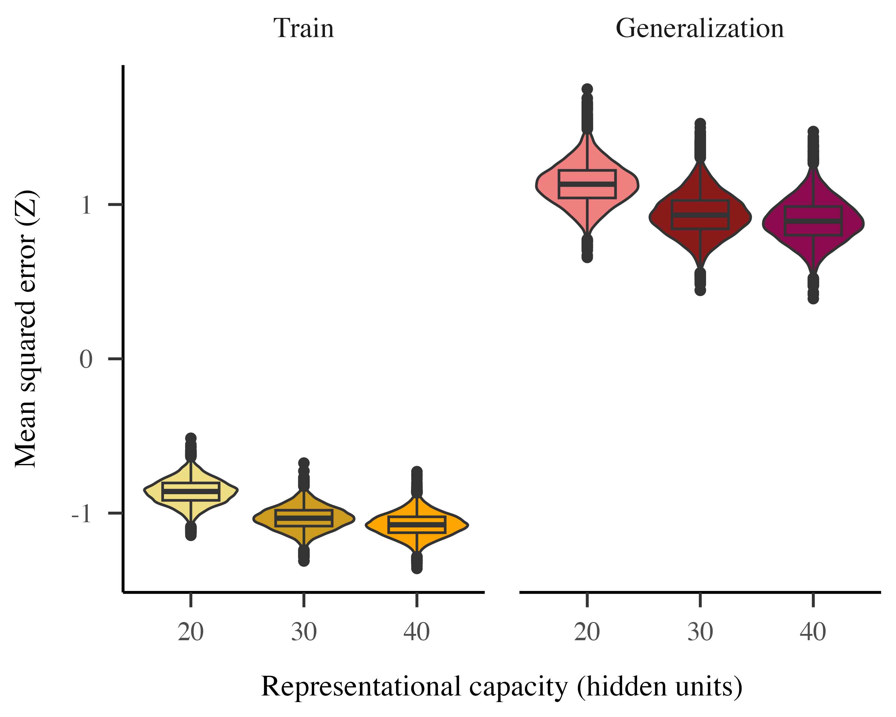

```{r}
require(papaja)
require(knitr)
require(tidyverse)
require(readxl)
require(cowplot)

# data
source("load.R")

```
# Introduction

By the time a child becomes a proficient reader, they have encountered thousands of distinct words. Each encounter exposes them to properties of print that provide the basis for learning and generalization. Early in development the critical properties primarily concern letters and sounds and their patterns of co-occurrence across words (Castles, Rastle, & Nation, 2019; Seidenberg & MacDonald, 2019). Due to a variety of factors including genetics, disability, instruction, and exposure to print, among others (Connor, Morrison, & Katch, 2004; Cunningham & Stanovich, 1993; Cunningham & Stanovich, 2013; Gayan & Olson, 2003; Peterson & Pennington, 2015) children vary in their visual word recognition skills. The set of printed words that constitutes the child's learning environment (e.g., through reading aloud printed words independently or with others) is thought to be an additional factor that influence outcomes. Indirect evidence for this can be found in experimental studies with highly controlled training environments: Children perform differently on words with different properties (e.g., length, regularity, consistency; Seidenberg et al., 1984) and differ in their choice of pronunciation for ambiguous test items (e.g., zead) after rehearsal on different practice items (e.g., heat and zeal or bread and head; Apfelbaum, Hazeltine, & McMurray, 2013). Learning studies have shown that even with limited exposure (even in absence of instruction) children are able to bootstrap their existing knowledge of letters and sounds to retain information about the identities of specific novel words to which they were previously exposed (Cunningham, Perry, Stanovich, & Share, 2002; Nation, Angell, & Castles, 2007). However, in studies that involve learning, less consideration is given to the variability in children’s performance vis-a-vis the exposure to words over a longer developmental span (i.e., over the course of early reading acquisition) and in generalization performance. 

In educational practice, the words children encounter are primarily selected based on their teachers’ implicit theories about how children learn. This often involves the assumption that children need to read most words quickly and accurately and can self-teach unfamiliar ones. In very early reading acquisition in an alphabetic language (e.g., English, Spanish, Dutch), one theory is that children achieve automaticity fastest through direct teaching on a large number of letter-sound patterns apparent in the language (e.g., the sound of ai in main). This is far less straightforward in writing systems like English where the mappings between letters and phonemes are less structured, a property known as quasiregularity (see Seidenberg, Cooper Borkenhagen, & Kearns, 2020 for a discussion). In quasiregular writing systems the ensembles of experiences with printed words are particularly important in early development given the lack of generativity of rules that relate individual letters and phonemes, though we know little about how learning experiences at the level of word ensemble relate to outcomes in word recognition skills (Compton, Miller, Elleman & Steacy, 2014).

As a proxy for learning about the properties of words that support learning and generalization across ensembles of words, children are typically taught letter-sound patterns prioritized by their frequency in the language alongside being provided texts containing many instances of these patterns (i.e., phonics instruction). A common alternative teaching approach to phonics  focuses on sight reading. In this approach, children are exposed to the most common words in the language and learn to pronounce them using methods that leverage rote memorization rather than emphasizing the letter-sound patterns they contain.

Importantly, these (and other) instructional theories employ different ideas about the types of experiences young readers should have with printed words on their way to skilled reading. Is it important to organize experiences in a way that privileges some words over others? This question motivates the current study. We consider whether word-recognition performance varies depending on the particular words students learn, i.e., the ensemble of words that comprises the child’s print learning environment. 

## Difficult Phenomena to Study
Answering this question has consequences for theories of reading acquisition and approaches to early reading instruction. Unfortunately, measuring the relative impacts of different ensembles of printed words is difficult because learning to read words aloud happens gradually over a wide developmental timescale, encompassing many learning trials distributed across many experiences with different words. This gradual process is difficult to capture with traditional experimentation given the challenges associated with controlling the learning environment for developing children at a large scale. Learning studies like those mentioned previously are designed to examine learning at a causal level using narrowly constructed learning experiments in a laboratory setting where factors can be carefully controlled (typically using nonwords to avoid confounds of familiarity with stimuli). Additionally, typical behavioral assessments cannot measure subtle differences in word reading performance (e.g., whether a given pronunciation includes minor imprecisions) or variation beyond the few items they include. 

## The Connectionist Approach
One way to assess acquisition and performance of this kind is to use simulations. Connectionism offers a robust set of tools to investigate these learning questions given the established success of connectionist models of human cognition (McClelland, Botvinick, Noelle, Plaut, Rogers, Seidenberg, & Smith, 2011). The paradigm has been used to model learning to read (Plaut, 2005; Seidenberg, Farry-Thorn, & Zevin, 2022); simulated learners have similar patterns of performance accuracy and response time as humans on word-reading measures. An important advantage (especially related to the current project) is the large scale at which connectionist models can be deployed in simulating environment effects on learning (see Cox, Cooper Borkenhagen, & Seidenberg, 2019 for an example). In the approach taken here, a series of models that simulate early print learning (naming a word based on its printed form) represents a large sample of learners, each trained with a different ensemble of words, each of which comprises 300 words randomly selected from a text corpus. Given that the models differ only with respect to their learning environment (i.e., the ensemble on which it is trained), differences in learning outcomes can be causally attributed to variation in the environment. Thus, observed differences in model performance after training provide evidence that the specific words encountered influence learning outcomes.

This approach also allows us to explore the degree to which reading experience matters relative to the characteristics of the learner, that is, capabilities of the learner that will affect their reading success. For example, Monaghan and Wollams (2017) simulated dyslexia in a reading model by adding noise to the part of the model responsible for pronunciation of the printed form. Patterson, Seidenberg, & McClelland (1989) created a model of dyslexia by reducing the system’s capacity by removing hidden units from the network, which resulted in a pattern similar to what is seen in children with a learning difficulty. In addition to studying the effects of print environment on outcomes, our method here involves manipulating models in a similar way to Patterson et al. (1989) by manipulating the number of hidden units in order to introduce variation in representational capacity. 

Measuring the relative impact of words on later reading performance is challenging when using real-world samples because human learners vary in countless ways, both observable and unobservable, which can confound analyses. While statistical methods, such as regression, can control for some of these factors in examining human performance, these methods are limited in their ability to account for all sources of variability. This makes it difficult to isolate the specific influence of the words themselves among other covarying factors.

The simulation approach used here addresses this challenge by enabling precise experimental control around the capacities of the (simulated) learners and the learning environment to which learners are exposed. It allows us to (a) examine the performance of an identical learner across different word ensembles and (b) compare learners with systematically varied characteristics (e.g., representational capacity) on the same word ensemble. In the experiments reported here, we do both simultaneously in order to examine the extent to which the words matter for early print development outcomes for learners that vary in terms of their ability to represent print-speech mappings. 

## Questions
Our general question is whether the different ensembles of words learned during early reading acquisition contributed to different word reading outcomes. We investigate this with three specific questions. First, to what extent is there variation in learning as a function of exposure to ensembles of different training items? Second, to what extent is there variation in learning as evidenced in transfer effects to untaught words? Finally, is the effect of the training environment modulated by the capacity of the learner to represent the mappings between phonology and orthography?

Regarding questions one and two, we anticipate that there will be wide variation in performance on the words learned, and that this variation would also be evidenced in generalization items at the end of learning. With regard to question three, variability in the ensemble effect based on learning capacity, in general we expected for models with reduced representational capacity to perform more poorly and with greater variability than their high-capacity counterparts. We expected this increase in variation because we anticipate that learners with diminished capacity to map print to speech would benefit more from ensembles that, in general, confer better (more generalizable) print-speech structure.

# Methods
## Word Data
Monosyllabic words ($N$ = 2,869) were collected from popular children’s books, taken from the corpus developed in Lewis et al. (2021). All monosyllabic words from the Lewis et al. (2021) corpus comprised the pool of words from which training and generalization items were sampled. Learning was weighted by frequency such that during each learning trial the error signal associated with any word presented to the model was proportional to its frequency as established in the Hypertext Analog of Language corpus (Lund & Burgess, 1996; accessed through data from English Lexicon Project, see Balota et al., 2007)^[See appendix for a technical description of how the scaling is accomplished.]. All words participating in the simulations were monosyllabic. Table 1 presents descriptive statistics for both the full dataset and the subset of the data that were only used to evaluate generalization (in a holdout set never used for model training). The values for the descriptive statistics did not show a significant difference between the holdout items and the others: letters, $F$(1, 2868) = 3.38, $p$ = .07; phonemes, $F$(1, 2774) = 3.25, $p$ = .07; frequency $F$(1, 2773) = 1.08, $p$ = .30.

```{r table1}

table_1 = read_csv("data/table_1.csv")

colnames(table_1) = c("Variable", "Mean", "SD", "Min", "Max", "Mean", "SD", "Min", "Max")

table_1 %>% 
  apa_table(caption = "Descriptive Statistics for Words Included in Sampling Process",
            note = "300 holdout items were selected from 2,869 items in the full dataset. Frequency = log transformed frequency of words from Hyperspace Analogue of Language (Lund & Burgess, 1996).",
            col_spanners = list(`Holdout Items` = c(2, 5),
                                `Full Dataset` = c(6, 9)))

```

## Training and Holdout Item Sets
Models learned 300 words across 50 learning trials (epochs) and were all tested on the same independent set of 300 holdout words in order to examine generalization. This number of epochs was chosen because testing different configurations revealed this to be a reasonable number of weight updates to achieve asymptotic performance across a large number of pilot runs and to do so in a way that could be accomplished on a short timeline (in terms of learning). Other values are also possible but yielded similar results during a pilot phase. The testing procedure is described more fully below in the “Testing” section.

## Modeling Procedure
Computational models that map print to speech were used, following the procedures in other simulation work (Brown et al., 2015; Cox et al., 2019; Harm & Seidenberg, 1999; Seidenberg & McClelland, 1989). The model architecture used here was a feedforward network with 260 orthographic input units, 175 phonological output units, and an experimentally manipulated number of hidden units  (see description of representational capacity below). Each orthographic unit has a directed, weighted connection to every hidden unit, and each hidden unit has a directed, weighted connection to every phonological unit. Every hidden and phonological unit also receives weighted input from a special unit that always has activation equal to 1 (i.e., a bias unit), which serves a similar function as the intercept term in a linear regression. The networks were all trained in ways that were consistent with other connectionist implementations of feedforward reading models (Seidenberg & McClelland, 1989; Plaut et al., 1996). During learning weights were updated using gradient descent through the use of backpropagation. Error was calculated using binary cross entropy as the loss function (see Plaut et al., 1996 for similar simulations). Except for the number of hidden units, all other hyperparameters were decided prior to experimentation and held constant for all models. Notably, we used a batch size of 16, a learning rate of .01, and 50 training epochs. Models were implemented in Python 3.11.5 using Keras 2.12.0 with Tensorflow 2.12.0 as the backend.

Input and output patterns were generated by concatenating representations for letters and phonemes, respectively. Words were vowel-centered such that leftmost vowel appeared in the 4th slot for both orthography and phonology. The methods for creating representations were taken from prior connectionist reading simulations (Brown et al, 2015; Cox et al., 2019; Harm & Seidenberg, 1999). First, each letter in a string is assigned to a sequential orthographic "slot", such that the first vowel in each string occupies the same slot across words; this was the fourth slot for our set of words. For words where two vowel letters correspond to a single vowel phoneme, the orthographic slot following the first vowel letter is occupied by the second vowel letter. For all other words, this slot is left blank, so that every slot handles only consonants or only vowels. For example, "eat" was represented “____eat__\_” and “at” was represented “\_\_\_\_a\_t\_\_\_”^[The notation here includes empty slots as “_”, which in the implemented model are represented as vectors where all features are off (i.e., are zeros).]. Representations are configured in this way such that all orthographic inputs have the same number of slots (10 total). Padding representations in this way ensures that all representations are the same length and "vowel centered". The same padding logic is followed to assign phonemes to slots; the vowel occupies the fourth slot and each representation has seven slots. The value in each slot (including the "empty" value) is translated into binary vectors that the model can utilize as either an input or output (in these simulations the input is always orthography and the output is always phonology). Each orthographic slot is replaced with a 26-element vector that orthogonally codes each of the 26 letters of the English alphabet (i.e., "a" has 1 in the first position and 0 elsewhere, "b" has 1 in the second position and 0 elsewhere, etc.). Empty slots are all-zero vectors of length 26. Likewise, each phonological slot is replaced by a 33-element binary vector. However, rather than being orthogonal like the letter representations, phonemes are coded as distributed representations (see Harm & Seidenberg, 1999), where each position in the vector corresponds to distinct phonological features. Distributed representations for phonemes were used to represent each phoneme for a word situated in a seven slot output representation. Features were defined by standard distinctive features used to uniquely identify the sounds of English (Chomsky & Halle, 1968; see Harm & Seidenberg, 1999 for a description of the features used).

Finally, the vectors within each slot are concatenated to form a single pair of orthographic and phonological vectors for each word. Orthographic and phonological vectors are then arranged into separate matrices in order to be utilized during simulations. Empty phonological slots are filled with all-zero vectors of length 33. A depiction of the network is shown in Figure 1.

```{r figure1, fig.cap='A depiction of the network architecture and hyperparameter values. Hyperparameters used for simulations are listed in the box labeled “Network Structure”. See similar architectures in Plaut et al. (1996), Simulation 1, Seidenberg & McClelland (1989), and Cox et al. (2019). Layers are represented with circles and boxes and arrows represent weight matrices, as in depictions of connectionist reading models elsewhere. The layers are not represented with the total number of units actually specified in models, but are simplified to preserve space in the figure.'}


```

  
## Representational Capacity (i.e., Hidden Units)
The representational capacity of the model was manipulated by changing the number of hidden units in the network. This was done in such a way that each ensemble in one level of hidden unit has an identical “twin” in each other level such that the only thing that differed across them was the number of hidden units. This manipulation allowed us to test whether the effect of word set (the ensemble effect) differed based on characteristics of different models (the learner effect). The manipulation of hidden units is associated with variation found across readers given that hidden units provide the underlying capacity with which print and speech can be integrated in the model (Seidenberg & McClelland, 1989). Models with very few hidden units fail to encode generalizable structure in the training corpus. This is particularly problematic in writing systems like English where letters and sound map together in quasiregular ways (Seidenberg et al., 2020).

## Number of Training Runs
The words selected for training and the representational capacity of each model were both manipulated. At each level of three capacity conditions (ranging from 20 to 40 hidden units) 10,000 models were run (*N* = 30,000). Simulations were conducted such that for each of the 10,000 models within each level of representational capacity there was a “twin” model in each of the other levels. Each set of twins differed only in terms of the representational capacity they possessed, and were matched in terms of the ensemble of words and all other hyperparameters of the simulation other than hidden units (i.e., learning rate, training epochs, batch size). The capacity conditions were static across models but training items were sampled randomly from the 2,869 words in the full monosyllabic word corpus. For each training ensemble a random set of 300 words was drawn from the corpus. No two ensembles were identical. See supplement for identities of words included in the sampling process. Words were presented in the same order throughout training for all models.


## Testing
### Error Metric
A primary objective of learning is a high level of achievement of the subject material. In order to assess each model’s learning at the end of the training period we analyze the error associated with each model’s performance on the training and holdout sets (300 words each) using mean squared error. This measure of error is common among simulation studies using connectionist models of reading because of the direct way in which error reflects processing difficulties associated with the model’s ability to produce a phonological output from orthographic input (e.g., Chang, Monaghan, & Welbourne, 2019; see also Seidenberg & McClelland, 1989, where summed squared error was used).  Mean squared error is calculated over output phonological features relative to the features for the word’s target. The formula for mean squared error is shown in (1). Here, $n$ is the number of output units ($n$ = 175), $y_i$ is the output of the $i$th unit, and $\hat{y}_i$ is the target state for that same ($i$th) unit.


$$
\textit{Mean Squared Error} = \frac{1}{n} \sum_{i=1}^{n} (y_i - \hat{y}_i)^2
\quad (1) 
$$
In the results section mean squared error is reported in its standardized form (standardized using all the training and test data) in order to represent variation in performance in a more concrete way (i.e. in standard deviation units). Raw mean squared error is also provided. Given our specific interest in the effect of word ensemble during learning and generalization, error for each model is averaged across all of its training words (when measuring training outcomes) and test words (when measuring generalization).

## Understanding the Error Metric
For additional context when interpreting error results we will say a few things about the relevance of error as a measure of performance in the models reported here (and other connectionist models of reading). The output for each word is a sequence of 175 features, each representing a binary phonological feature (e.g., plosive, nasal, bilabial, etc.) within a phonological slot associated with pronunciation. We analyze results in terms of performance (error) in the output features because it allows for continuously graded data on pronunciation. Table 2 provides examples of minimal pairs of alternative pronunciations and the corresponding impact on error (raw and standardized) on output features.


```{r table2}
read_csv("data/table_2.csv") %>% 
  mutate(Accuracy = printnum(Accuracy, digits = 3)) %>% 
  apa_table(caption = 'Hypothetical Distribution of Pronunciation Errors Relative to the Target Word “breathed”',
            note = "The difference between the pronunciation for “breathed” and “bruised” is four features (also sometimes referred to as “units”). Pronunciations are transcribed using the one-letter version of the ARPAbet. The change in number of features (Diff. features) is relative to the top row (“breathed”). Spellings for nonwords are hypothetical given the pronunciation. The estimates of change in standardized MSE (Diff. MSE Standardized) are taken from standardized data for training and generalization. Accuracy is provided for reference, though results in the paper are explained in terms of mean squared error. Note that the differences across successive rows are defined by differences in individual features, though they also result in differences in phonemes. It is not always the case that a difference of one feature results in two different legal phonemes in English.",
            format = list(Accuracy = "%.4f"))

```

## Additional Details
The simulation and analysis code can all be found in the project’s Github repository (github.com/XXX). Additional information can be found in the appendix and data for the project can be found in OSF (XXX).

# Results
## Differences in Outcomes on Training and Generalization Words
Models in general achieved low error on the training words (*M* = .0035, *SD* = .00055) relative to generalization (*M* = .012, *SD* = .00078), and the distribution for training and generalization words was non-overlapping. Noteworthy variation existed within and across these two sets, data for which is provided in Table 3.

```{r table3}
read_csv("data/table_3.csv") %>% 
  apa_table(caption = "Distribution of Mean Squared Error for Train and Generalization Sets",
            note = "Error is provided in raw form and standardized form. The standardized form appears in parentheses. These values are calculated across all words in each set (train and generalization), collapsing across representational capacity conditions.")

```

Given that outcomes of learning in children are often expressed in terms of the highest and lowest achievers, one way of expressing the variation in performance in these data is the difference between models that had the highest and lowest outcomes at the end of training. The highest performing model overall in the training set achieved a final error score of MSE = .0018 ($Z$ = 3.90). By comparison, the lowest performing model from that set achieved a final average error of MSE = .0056 ($Z$ = -3.04). The differences between these high and low performing models was 6.94 standard deviation units.

These differences are even more dramatic when testing models on their capacity to generalize. The highest performing model achieved an overall MSE for the generalization set of .01 ($Z$ = 4.41), and the lowest performing model an MSE of .02 ($Z$ = -3.48). The difference between performance among these models was 7.89 standard deviation units, which is depicted in Figure 2.

```{r figure2, fig.width=5, fig.height=3, fig.cap="The distribution of training and generalization items for each model at the end of training for both the raw and standardized mean squared error measures. Panel A shows raw mean squared error; Panel B shows mean squared error standardized. Performance on the training words was in general much better (lower error) than on the generalization words. Noteworthy variation exists within each set, leading to dramatic differences in performance for the lowest and highest achieving models. Standardized data (B) are displayed to afford an interpretation in standard deviation units, where standardization takes place within training and generalization sets respectively. Colors are conditioned on the set displayed (also noted on x-axis)."}

#


plot_a = model_summaries %>% 
  filter(metric == "mse") %>% 
  mutate(condition = factor(condition, levels = c("train", "holdout"))) %>% 
  ggplot(aes(factor(condition), value, fill = factor(condition))) +
  geom_violin() +
  geom_boxplot(width = .2, outlier.size = .2) +
  theme_apa() +
  labs(x = "Set", y = "Mean squared error (raw)") +
  theme(legend.position = "none") +
  scale_x_discrete(labels = c("train" = "Train", "holdout" = "Generalization")) +
  scale_fill_manual(values = c("goldenrod3", "firebrick4"))

plot_b = model_summaries %>% 
  filter(metric == "mse") %>% 
  mutate(condition = factor(condition, levels = c("train", "holdout"))) %>% 
  ggplot(aes(factor(condition), value_z, fill = factor(condition))) +
  geom_violin() +
  geom_boxplot(width = .2, outlier.size = .2) +
  theme_apa() +
  labs(x = "Set", y = "Mean squared error (Z)") +
  theme(legend.position = "none") +
  scale_x_discrete(labels = c("train" = "Train", "holdout" = "Generalization")) +
  scale_fill_manual(values = c("goldenrod3", "firebrick4"))

plot = plot_grid(plot_a, plot_b, labels = c("A", "B"))

plot
#ggsave("img/results_figure2.png", plot = plot, width = 5, height = 4, dpi = 600)


```


```{r correlationAcrossSets, warning=FALSE, message=FALSE, echo=FALSE}


# correlation
tmp  = model_summaries %>% 
  filter(metric == "mse" & condition == "train") %>% 
  mutate(tmp_id = str_c(model_id, "_", hidden_units)) %>% 
  arrange(desc(value)) %>% 
  mutate(rank_train = seq_len(n())) %>% 
  select(tmp_id, rank_train)


tmp_2 = model_summaries %>% 
  filter(metric == "mse" & condition == "holdout") %>% 
  mutate(tmp_id = str_c(model_id, "_", hidden_units)) %>% 
  arrange(desc(value)) %>% 
  mutate(rank_holdout = seq_len(n())) %>% 
  left_join(tmp) 

corr = cor.test(tmp_2$rank_holdout, tmp_2$rank_train)


```

Foreshadowing later results, one important outcome concerns the relative performance of models in the training and generalization sets. It might be intuitive to think that achievement on one set (training or generalization) would correspond directly to achievement on the other. That is to say, that reading performance on words taught would result in strictly comparable performance on generalization words. Our experiments suggest otherwise. The correlation between performance in train and generalization sets for these models was $\rho$ = `r round(corr$estimate[[1]], digits = 2)` ($p$ < .001, 95% CI = [`r round(corr$conf.int[[1]], digits = 2)`, `r round(corr$conf.int[[2]], digits = 2)`]). To provide a concrete example of this partial correlation, of the 100 worst performing models in the generalization set, only two models were also in the poorest performing models in the training words. This is potentially important because it suggests something deeper about the impacts of ensembles of words, namely that the learning environment might confer learning benefits that don’t transfer robustly beyond the words directly taught. 

## Differences in Outcomes across Levels of Representational Capacity
Our experiment was designed to answer an additional question about the impact of word ensemble on learning outcomes: is there meaningful variation for learners with reduced representational resources? In general, generalization items were associated with more error than training, and models with less representational capacity were associated with higher error in both the training and generalization items. Results in both raw and standardized form are shown in Table 4 and Table 5.


```{r table4}

table_4 = read_csv("data/table_4.csv") %>% 
  mutate(`Representational Capacity` = as.character(`Representational Capacity`))

table_4 %>% 
  apa_table(caption = "Descriptive Statistics on Training Words for All Levels of Representational Capacity",
            note = "For each value the standardized (Z) version of mean squared error is shown in parentheses.")


```


```{r table5}

table_5 = read_csv("data/table_5.csv") %>% 
  mutate(`Representational Capacity` = as.character(`Representational Capacity`))

table_5 %>% 
  apa_table(caption = "Descriptive Statistics on Generalization Words for All Levels of Representational Capacity",
            note = "For each value the standardized (Z) version of mean squared error is shown in parentheses.")


```


In the training items, models with 20 hidden units are on average associated with 1.41 standard deviations higher error than models with 30 hidden units and 1.77 standard deviations higher error than 40 hidden units. These same trends exist in the generalization set. Models with 20 hidden units are on average associated with 1.14 standard deviations higher error than models with 30 hidden units and 1.38 standard deviations higher error than models with 40 hidden units. These trends across levels of representational capacity for the training and generalization sets are shown in Figure 3.

```{r figure3, fig.width=6, fig.height=3, fig.cap = "The distribution of training and generalization items for each model at the end of training for both raw mean squared error (Panel A) and standardized (Panel B). Performance on the training words was in general much better (lower error) than on the generalization words (A). Noteworthy variation exists within each set, leading to dramatic differences in performance for the lowest and highest achieving models. Data in B are displayed in terms of standardized mean squared error to afford an interpretation in standard deviation units, where standardization takes place within training and generalization sets, respectively. HUs = hidden units."}

#
axis_titles = 10
strip_text = 8

plot_a = model_summaries %>% 
  filter(metric == "mse") %>% 
  mutate(condition = case_when(condition == "holdout" ~ "Generalization",
                               condition == "train" ~ "Train")) %>% 
  mutate(condition = factor(condition, levels = c("Train", "Generalization"))) %>% 
  ggplot(aes(factor(hidden_units), value, fill = interaction(factor(condition), factor(hidden_units)))) +
  geom_violin() +
  geom_boxplot(width = .5, outlier.size = .2) +
  theme_apa() +
  facet_wrap(~condition) +
  theme(#text = element_text(family = "times"),
        legend.position = "none",
        axis.title = element_text(size = axis_titles),
        strip.text = element_text(size = strip_text)) +
  labs(x = "Representational capacity (HUs)",
       y = "Mean squared error (raw)") +
  scale_fill_manual(values = c("Train.20" = "lightgoldenrod", "Train.30" = "goldenrod3", "Train.40" = "orange", "Generalization.20" = "lightcoral", "Generalization.30" = "firebrick4", "Generalization.40" = "deeppink4"))


plot_b = model_summaries %>% 
  filter(metric == "mse") %>% 
  mutate(condition = case_when(condition == "holdout" ~ "Generalization",
                               condition == "train" ~ "Train")) %>% 
  mutate(condition = factor(condition, levels = c("Train", "Generalization"))) %>% 
  ggplot(aes(factor(hidden_units), value_z, fill = interaction(factor(condition), factor(hidden_units)))) +
  geom_violin() +
  geom_boxplot(width = .5, outlier.size = .2) +
  theme_apa() +
  facet_wrap(~condition) +
  theme(#text = element_text(family = "times"),
        legend.position = "none",
        axis.title = element_text(size = axis_titles),
        strip.text = element_text(size = strip_text)) +
  labs(x = "Representational capacity (HUs)",
       y = "Mean squared error (Z)") +
  scale_fill_manual(values = c("Train.20" = "lightgoldenrod", "Train.30" = "goldenrod3", "Train.40" = "orange", "Generalization.20" = "lightcoral", "Generalization.30" = "firebrick4", "Generalization.40" = "deeppink4"))

plot = plot_grid(plot_a, plot_b, labels = c("A", "B"))


plot

#ggsave("img/results_figure3.png", plot = plot, width = 6.5, height = 4, dpi = 600)


```

This effect bears out in a linear mixed effects model predicting mean squared error from number of hidden units. Here, to simplify the statistical model we modeled using a subset of the data given its large scale ^[See appendix information for a description of the modeling procedure used.]. An unconditional model with random intercepts for word and ensemble ^[In the code for the project, ensemble is identified as "model ID".] had a better fit than a model without an ensemble random effect, $\chi^2$(1) = 3069.80, $p$ < .001. In addition, we compared the fit of a model with the slope for the number of hidden units on the ensemble random effect (does the degree of variation in accuracy due to ensemble differ at different levels of hidden unit?) to one without a hidden-unit slope. The more complex statistical model, that with the hidden unit slope on the ensemble random intercept fit better, $\chi^2$(2) = 15.43, $p$ < .001. Table 6 displays the results.

\begin{table}[ht]
\centering
\caption{Output of Linear Mixed Effects Model}
\begin{tabular}{lcccccc}
\toprule
\textbf{Predictor} & \textbf{Estimate} & \textbf{Std. Error} & \textit{df} & \textit{t} & \textit{p} \\
\midrule
Intercept & 0.574 & 0.041 & 300 & 14.03 & < 0.001 \\
Hidden & -0.022 & 0.001 & 300 & -33.44 & < 0.001 \\
\midrule
\textbf{Variance Components} & \textbf{SD} & \textbf{Corr} & & & \\
\midrule
\multicolumn{6}{l}{\textit{Ensemble}} \\
\hspace{1em}Intercept & 0.0378 & & & & \\
\hspace{1em}Hidden & 0.0007 & 0.03 & & & \\
\midrule
\multicolumn{6}{l}{\textit{Word}} \\
\hspace{1em}Intercept & 0.7072 & & & & \\
\hspace{1em}Hidden & 0.0115 & -0.52 & & & \\
\textit{Residual} & 0.6863 & & & & \\
\bottomrule
\end{tabular}
\end{table}

The final result indicates different degrees of variability in the effect of the ensemble due to the number of hidden units. In this case, the result indicated that models with fewer hidden units showed more variability than models with more hidden units. 

## Differences in Specific Ensembles at Different Levels of Representational Capacity

```{r corrBetween20and40, warning=FALSE, echo=FALSE, message=FALSE}
tmp = model_summaries %>% 
  filter(metric == "mse") %>% 
  filter(hidden_units == 20 & condition == "holdout") %>% 
  select(model_id, hu20 = value_z) %>% 
  left_join(model_summaries %>% 
  filter(metric == "mse") %>% 
  filter(hidden_units == 40 & condition == "holdout") %>% 
  select(model_id, hu40 = value_z))

corr = cor.test(tmp$hu20, tmp$hu40)


```


In addition to examining generally whether or not performance differs in training and generalization words across levels of representational capacity, the experiment is able to answer a more specific question: would a learner perform comparably (relative to all other learners) if you could change their representational capacity to map orthography to phonology? We examined this by computing the rank correlation between the lowest (20) and highest (40) levels of hidden units in mean squared error in the holdout words, resulting in $\rho$ = `r round(corr$estimate[[1]], digits = 2)` ($p$ < .001, 95% CI = [`r round(corr$conf.int[[1]], digits = 2)`, `r round(corr$conf.int[[2]], digits = 2)`]).

Given that each model has an equivalent “twin” model at all other levels of representational capacity (i.e., the only thing that differs is the number of hidden units; all other aspects are held constant), this correlation provides a precise estimate of the effect of representational capacity on learning outcome. The fact that the correlation is not equal to 1 is surprising, suggesting the dynamic nature in which representational capacity and ensemble interact.
 
This effect is depicted visually in Figure 4, Panel A for models with 20 and 40 hidden units, where Panel C depicts the distribution of differences in rank for all models across 20 and 40 hidden units. Given that the correlation between ranks at these two levels of hidden units is only partial (< 1), the differences in rank varies, as indicated by the gradient in the lines connecting distributions in Panel A and the spread in Panel C. In Panel A, parallel lines (with each other) would indicate that the rank order did not change. Panel B shows the models that move in rank most dramatically (in both positive and negative difference) across these two levels of hidden units. These data provide evidence that the ensemble affects learning outcome such that the same ensemble can be associated with different performance depending on the representational capacity of the learner.

```{r figure4, fig.width=6, fig.height=6, fig.align = "center", fig.cap="Differences in mean squared error in generalization performance across models of 20 and 40 hidden units are depicted in three different ways. Panel A shows the distributions for mean squared error as violin plots and box plots for models of 20 and 40 hidden units as well as lines connecting the position of each model in one distribution to the other. The lines are colored with a gradient that indicates the amount of difference for each model in the rank distribution of mean squared error across each level of hidden units. Panel B shows the top 20 models whose differences in rank in the two distributions are greatest. Dashed lines show the 10 models which increased in rank most dramatically, and dotted lines show the models which decreased in rank most dramatically. Panel C shows the distribution of the differences in rank also depicted in Panels A and B but as a histogram. Each word ensemble appears in every level of hidden unit, therefore each ensemble has a single difference in rank associated with it across 20 and 40 hidden units, allowing for a histogram of differences. The difference value is calculated as the rank for a given ensemble at 20 hidden units minus the same model’s rank at 40 hidden units. The extreme values (min = -5065, max = 6586) represent the greatest change in rank performance for a model across the 20 and 40 hidden unit conditions (see also Panel B)."}


text_size = 8

differences_in_rank = model_summaries %>% 
  filter(hidden_units %in% c(20, 40)) %>% 
  filter(metric == "mse" & condition == "holdout") %>% 
  group_by(hidden_units) %>%
  arrange(desc(value_z)) %>% 
  mutate(rank = seq_len(n())) %>% 
  ungroup() %>%
  group_by(model_id) %>%
  arrange(-desc(hidden_units)) %>% 
  summarize(difference = diff(rank))


plot_a = model_summaries %>% 
  filter(hidden_units %in% c(20, 40)) %>% 
  filter(metric == "mse" & condition == "holdout") %>% 
  left_join(differences_in_rank, by = "model_id") %>% 
  ggplot(aes(factor(hidden_units), value_z)) +
  geom_line(linewidth = .2, aes(group = model_id, color = difference)) +
  geom_violin(aes(fill = factor(hidden_units))) +
  geom_boxplot(width = .2, outlier.size = .2) +
  theme_apa() +
  labs(title = "Differences in rank outcome\n 20, 40 hidden units (holdout only)",
       x = "Representational capacity (in hidden units)", 
       y = "Mean squared error (Z)", 
       fill = "Hidden units") +
  scale_fill_manual(values = c("lightcoral", "deeppink4")) +
  scale_color_gradientn(colors = heat.colors(10)) +
  theme(legend.position = "none",
        plot.title = element_text(size = text_size),
        plot.subtitle = element_text(size = text_size),
        axis.text = element_text(size = text_size),
        axis.title = element_text(size = text_size))


plot_b = differences_in_rank %>% 
  ggplot(aes(difference)) +
  geom_histogram(color = "black", fill = "turquoise") +
  labs(x = "Difference in rank outcome", y = "Count",
       title = "Differences in rank outcome for each model") +
  theme_apa() +
  theme(plot.title = element_text(size = text_size),
        axis.text = element_text(size = text_size),
        axis.title = element_text(size = text_size))
  

# spotlighting top movers
bottom_10 = differences_in_rank %>% 
  arrange(difference) %>% 
  slice_head(n = 10) %>% 
  mutate(status = "bottom")

top_bottom_10 = differences_in_rank %>% 
  arrange(desc(difference)) %>% 
  slice_head(n = 10) %>% 
  mutate(status = "top") %>% 
  rbind(bottom_10)

plot_c = model_summaries %>% 
  filter(hidden_units %in% c(20, 40)) %>% 
  filter(metric == "mse" & condition == "holdout") %>% 
  left_join(top_bottom_10)  %>%
  mutate(model_id_ = case_when(is.na(status) ~ NA,
                               !is.na(status) ~ model_id)) %>% 
  ggplot(aes(factor(hidden_units), value_z)) +
  geom_violin(aes(fill = factor(hidden_units))) +
  geom_boxplot(width = .2, outlier.size = .2) +
  geom_line(linewidth = .2, na.rm = TRUE, alpha = .9, aes(group = model_id_, color = status, linetype = status)) +
  theme_apa() +
  labs(title = "Top 20 movers in differences in outcome\nmodels at 20, 40 hidden units (holdout only)",
       x = "Representational capacity (in hidden units)", 
       y = "Mean squared error (Z)", 
       fill = "Hidden units") +
  scale_fill_manual(values = c("lightcoral", "deeppink4")) +
  theme(legend.position = "none",
        plot.title = element_text(size = text_size),
        plot.subtitle = element_text(size = text_size),
        axis.text = element_text(size = text_size),
        axis.title = element_text(size = text_size)) +
  scale_color_manual(values = c("top" = "grey22", "bottom" = "black")) +
  scale_linetype_manual(values = c("dashed", "dotted"))


top<- plot_grid(plot_a, plot_c, ncol = 2)

# Arrange the bottom row plot centered
bottom <- plot_grid(NULL, plot_b, NULL, ncol = 3, rel_widths = c(.5, 1.5, .5))

# Combine the top and bottom rows
plot <- plot_grid(top, bottom, ncol = 1, rel_heights = c(1, 1))
plot

```


# Discussion
Do learning different ensembles of words contribute to differential outcomes in word reading skill? We investigated this question by simulating large numbers of learners who differed only in terms of the words they were taught and the representational resources they possessed. First, the data suggest that differences in outcomes measured in a set of held-out generalization words demonstrates clearly that there is variation associated with the ensemble of words comprising the learning environment. For example, the difference between the best and worst performing learners in terms of generalization accuracy across all conditions in the study was 7.89 standard deviation units of the outcome measure (mean squared error). The way in which the experiment was implemented permits a causal interpretation: The words matter in terms of learning outcomes when learning to pronounce printed words. More specifically, two learners who are otherwise the same differ in learning outcomes when exposed to different ensembles of printed words comprising their learning environment.

Second, we found that word ensemble interacts with the learner’s representational capacity; the benefits that a particular set of words confers to a learner can be different depending on the learner’s capacity to represent print-speech mappings. In general, less representational capacity is associated with more variation on training items (approximately the same variation on generalization items) and poorer performance overall. Representational capacity was manipulated such that learners had a twin model in each of the other levels, where the only aspect of learning that varied for that set of three twin models was the number of hidden units. Despite these shared characteristics (i.e., all factors other than capacity), we found that sets of twin learners occupied different positions in the error distribution across representational capacity. 

The findings are potentially important when considering variation that exists in the learning environment of young children as they develop word recognition skills. Children are exposed to a teaching signal for a variety of different words during development, and from a variety of different sources (see Seidenberg & MacDonald, 2018 for a discussion). These include instruction, informal book reading in the educational context, shared book reading with caregivers, and other daily experiences (Castles, Rastle, & Nation, 2019). These events are likely associated with variable outcomes, the effects of which are difficult to detect directly through observation and experimentation given the variety of confounding factors; children’s experiences vary in a variety of ways and this variation increases as one observes the child’s experiences over increasingly large timescales. One indication of this variation is from the National Association of Educational Progress in the United States, which has found persistent (and increasing) differences in performances for children across a number of educational outcomes, including word reading (NCES, 2024).  We’ve simulated one aspect of the associated learning processes and prospective outcomes in a large-scale computational implementation of word recognition, finding that when controlling for a range of learning factors the ensemble of words that the child encounters during learning is likely an important contributing factor associated with variable outcomes. 

Indeed, educational programs are developed with the idea that words matter, but with little direct research to support the idea. There is direct evidence that instructional methods influence word recognition development (Foorman et al., 1998). Differences in the design of reading curricula or other reading materials can be primarily attributed to degrees of freedom enjoyed by the designers of the material. For example, a program that focuses on “sight word” instruction alongside phonics rules will identify sight words likely using a popular resource from the educational literature. While there are many, few of them have empirical evidence supporting their effectiveness, and their contents are generally only partially overlapping. For example, the popular set of words used by educators known as “the Dolch list” (Dolch, 1936) shares only 46% of words with another very popular list known as “the Fry list” (Fry, 1980). Likewise, no two programs that teach phonic patterns focus on the same phonic elements in doing so. Our study provides a window into the likely effects one might find in children subjected to these variable instructional environments, where we should expect some resources to perform better than others. 
Additionally, we’ve presented a tractable and scalable method for investigating individual differences in word reading development using established mechanistic models of learning developed in the cognitive sciences (Plaut et al., 1996; Seidenberg & McClelland 1989). While these findings don’t directly establish practices that can be adopted immediately in applied settings per se, the method provides potential promise to such ends. Nonetheless, our findings indicate something of educational importance that has not been tested directly in previous studies of learning to read: the ensemble of words the child is exposed to in early development matters, and learners with the least likelihood of establishing a coherent representation for printed words require, on average, a more carefully curated learning environment. In the case of early readers, this supports the important idea that the structure of the environment and the learner’s ability interact in such a way that we should be sensitive to when designing their reading environment. Our specific findings on the relative benefits of words and the interaction with representational capacity fits with analogous but general findings from instructional science that children who struggle tend to benefit more from word reading environments that are more explicitly tuned to meet their specific needs. For example, Connor, Morrison, & Katch (2004) found that children with low vocabulary performance benefitted from instruction that involved the teacher’s explicit involvement in code-oriented instruction. In essence, more deliberate construction of the environment helped children exploit the structure of the language for children with diminished representational resources (see also Connor et al., 2007). We’ve investigated performance in terms of the differential effects of word ensemble in simulations that permit large scale experimentation in ways not easily achieved in children. Questions of precisely how to investigate such effects in children should be addressed in future research. Research should also focus on the specific characteristics of ensembles of words as they relate to specific individual learners. Our methods here have investigated the issue by simulating random variation over many learners. This work provides an empirical basis for justifying the construction of the environment at this more granular level of learning experiences despite the large scale and temporally diffuse nature of this particular learning domain.


# References
\begin{hangparas}{1.5em}{1}

Apfelbaum, K. S., Hazeltine, E., I\& McMurray, B. (2013). Statistical learning in reading: Variability in irrelevant letters helps children learn phonics skills. Developmental Psychology, 49(7), 1348–1365. https://doi.org/10.1037/a0030817

Bates, D., Mächler, M., Bolker, B., I\& Walker, S. (2015). Fitting linear mixed-effects models using lme4. Journal of Statistical Software, 67(1), 1-48. https://doi.org/10.18637/jss.v067.i01

Castles, A., Rastle, K., I\& Nation, K. (2018). Ending the reading wars: Reading acquisition from novice to expert. Psychological Science in the Public Interest, 19(1), 5-51. https://doi.org/10.1177/1529100618772271

Chang, Y. N., Monaghan, P., I\& Welbourne, S. (2019). A computational model of reading across development: Effects of literacy onset on language processing. Journal of Memory and Language, 108, 104025. https://doi.org/10.1016/j.jml.2019.05.003

Chomsky, N., I\& Halle, M. (1968). The sound pattern of English. Harper and Row.

Connor, C. M., Morrison, F. J., I\& Katch, L. E. (2004). Beyond the reading wars: Exploring the effect of child-instruction interactions on growth in early reading. Scientific Studies of Reading, 8(4), 305-336.

Connor, C. M., Morrison, F. J., Fishman, B. J., Schatschneider, C., I\& Underwood, P. (2007). Algorithm-guided individualized reading instruction. Science, 315(5811), 464-465. https://doi.org/10.1126/science.1134513

Cox, C. R., Borkenhagen, M. C., I\& Seidenberg, M. S. (2019, July). Efficiency of Learning in Experience-Limited Domains: Generalization Beyond the Wug Test. In CogSci (Vol. 2019, pp. 1566-1571).

Cunningham, A. E., Perry, K. E., Stanovich, K. E., I\& Share, D. L. (2002). Orthographic learning during reading: Examining the role of self-teaching. Journal of Experimental Child Psychology, 82(3), 185-199.

Cunningham, A. E., I\& Stanovich, K. E. (1993). Children's literacy environments and early word recognition subskills. Reading and Writing, 5, 193-204. https://doi.org/10.1007/BF01027484

Cunningham, A. E., I\& Stanovich, K. E. (2013). The impact of print exposure on word recognition. In Word recognition in beginning literacy (pp. 235-262). Routledge.

Gayán, J., I\& Olson, R. K. (2003). Genetic and environmental influences on individual differences in printed word recognition. Journal of Experimental Child Psychology, 84(2), 97-123. https://doi.org/10.1016/S0022-0965(02)00181-9

Harm, M. W., I\& Seidenberg, M. S. (1999). Phonology, reading acquisition, and dyslexia: Insights from connectionist models. Psychological Review, 106(3), 491–528. https://doi.org/10.1037/0033-295X.106.3.491

McClelland, J. L., Botvinick, M. M., Noelle, D. C., Plaut, D. C., Rogers, T. T., Seidenberg, M. S., I\& Smith, L. B. (2010). Letting structure emerge: Connectionist and dynamical systems approaches to cognition. Trends in Cognitive Sciences, 14(8), 348–356. https://doi.org/10.1016/j.tics.2010.06.002

Monaghan, P., I\& Woollams, A. M. (2017). Implementing the “Simple” model of reading deficits: A connectionist investigation of interactivity. In Neurocomputational Models of Cognitive Development and Processing: Proceedings of the 14th Neural Computation and Psychology Workshop (pp. 69-81).

Nation, K., Angell, P., I\& Castles, A. (2007). Orthographic learning via self-teaching in children learning to read English: Effects of exposure, durability, and context. Journal of Experimental Child Psychology, 96(1), 71-84.

National Center for Education Statistics [NCES]. (2024). The Nation's Report Card: 2024 mathematics and reading assessments. https://www.nationsreportcard.gov/)

Patterson, K., Seidenberg, M. S., I\& McClelland, J. L. (1989). Connections and disconnections: Acquired dyslexia in a computational model of reading processes. In R. G. M. Morris (Ed.), Parallel distributed processing: Implications for psychology and neurobiology (pp. 131–181). Clarendon Press/Oxford University Press. 

Peterson, R. L., I\& Pennington, B. F. (2015). Developmental dyslexia. Annual review of clinical psychology, 11(1), 283-307.

Plaut, D. C. (2005). Connectionist Approaches to Reading. In M. J. Snowling I\& C. Hulme (Eds.), The science of reading: A handbook (pp. 24–38). Blackwell Publishing. https://doi.org/10.1002/9780470757642.ch2

Seidenberg, M. S., I\& McClelland, J. L. (1989). A distributed, developmental model of word recognition and naming. Psychological Review, 96(4), 523–568. https://doi.org/10.1037/0033-295X.96.4.523

Seidenberg, M. S., Farry-Thorn, M., I\& Zevin, J. D. (2022). Models of word reading: What have we learned? In M. J. Snowling, C. Hulme, I\& K. Nation (Eds.), The science of reading: A handbook (2nd ed., pp. 36–59). Wiley Blackwell. https://doi.org/10.1002/9781119705116.ch2

Seidenberg, M. S., I\& MacDonald, M. C. (2018). The impact of language experience on language and reading: A statistical learning approach. Topics in Language Disorders, 38(1), 66-83. https://doi.org/10.1097/TLD.0000000000000144

Seidenberg, M. S., Waters, G. S., Barnes, M. A., I\& Tanenhaus, M. K. (1984). When does irregular spelling or pronunciation influence word recognition? Journal of Verbal Learning and Verbal Behavior, 23(3), 383–404. https://doi.org/10.1016/S0022-5371(84)90270-2

\end{hangparas}

# Data Availability Statement
Data and code in order to reproduce all analyses included here can be found at the project's page on the Open Science Framework (XX). Code to run the simulations reported here can be found at the project's GitHub page (XX).

# Appendix
## Frequency Transformation
The frequencies were transformed in the same way as other connectionist approaches using similar networks (Seidenberg & McClelland, 1989) using the formula: p = K ॱ log(frequency + 1). A log transformation was applied to all the frequencies, which was in turn multiplied by a value, K. This resulted in values that were scaled between 0 and 1, which was captured the idea that for very frequent words the error signal should be high (i.e., approximately 1 times the loss for that word) and very infrequent words should receive relatively weak signal resulting from the corresponding calculation of loss for that word. In order to account for the fact that some words were not present in the Lund & Burgess (1996) corpus a constant was added to each frequency prior to being converted to log form in order to push very low values slightly away from zero. This resulted in a distribution such that the most frequent word “the” had a scaled value (p) of 1 and the least frequent values had values of near zero (1 x 10-6).

## Subsampling Procedure for Linear Mixed Effects Model
In order to estimate the statistical model included in the results section a subset of the complete dataset was obtained by randomly sampling 200 of the 10,000 word ensembles that participated in the study. This was done in order to allow the model to converge given the large dataset available for the linerar miced effects model (given that these models utilize data at the level of each individual observation/ word). The number 200 was selected because it was sufficiently large to support a robust statistical model but small enough such that that statistical model could converge. We anticipate that similar results would hold for other similarly large subsamples. In addition to the subsampling procedure, we also used the "bound optimization by quadratic approximation" optimizer implemented in the $lmer()$ function in the lme4 package in R (Bates et al., 2015).  The procedure for the sampling procedure and for all other analyses can be found in the project's OSF repository (XX).
